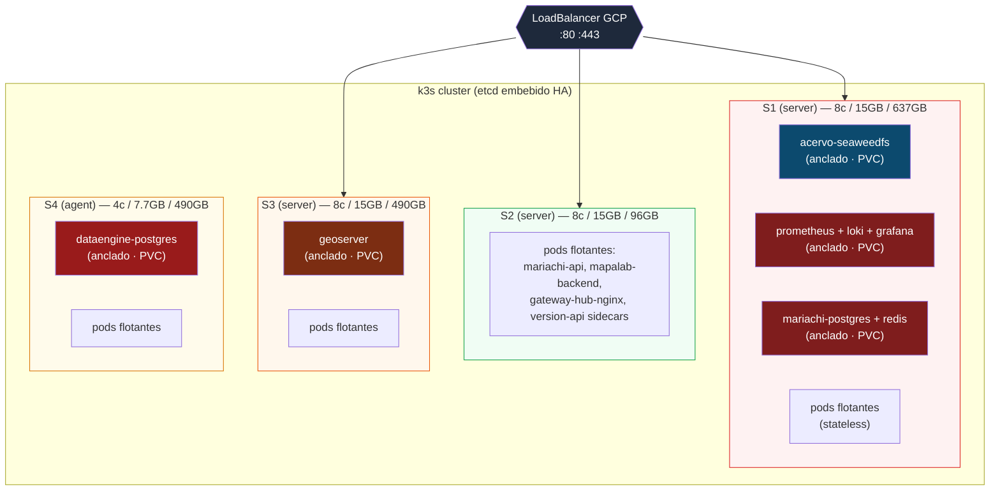

# Evaluacion: migrar el ecosistema IIEG a k3s/k8s

> **Estado:** documento de evaluacion, no decision. No comprometerse antes de releer.
> **Autor de la evaluacion:** sesion 2026-05-18.
> **Horizonte considerado:** 6-18 meses.

Este documento responde a la pregunta "¿que tan costoso seria implementar k8s o k3s
en el ecosistema actual?" tras el cierre de la iniciativa de versionado en vivo via
`/ontoy` (commits `8723c45`, `2ed7285`, `af34b98`, `8daab75`, `386dcf7`, `94b3ad7`).

---

## 1. Contexto: que tenemos hoy

### 1.1. Repos del ecosistema (10) y versiones actuales

| Repo | Version actual | Rol |
|---|---|---|
| gateway-hub | 1.25.0 | Reverse proxy + SSL + cache + rate limiting |
| acervo | 1.23.0 | Almacenamiento S3 (SeaweedFS) |
| huachicol | 1.20.1 | Monitoreo (Prometheus+Grafana+Loki+Alloy+cAdvisor) |
| dataengine | 1.14.3 | PostgreSQL 18 + PostGIS 3.6 + cron jobs |
| geoserver | 1.21.0 | OGC WMS/WFS/WCS sobre kartoza/geoserver 2.27.0 |
| sieej | 1.12.1 | Frontend estatico (dist servido por gateway) |
| mariachi | 1.1.0 | CMS + API + portal publico (React+FastAPI+Postgres+Redis) |
| mapalab | 1.28.5 | Visor de mapas (React+OpenLayers+FastAPI) |
| sitio2026 | 1.8.0 | Portal + CKAN (fuera del orquestador `ecosystem-up`) |
| minerva | 0.1.0 | IAM/SSO (Authentik, en piloto, fuera del orquestador) |

Inventario: ~25 containers, multiples redes Docker, todos orquestados con
`docker compose` + Makefile (`ecosystem-up` en gateway-hub).

### 1.2. Infraestructura GCP real

**Produccion: 4 servidores. 28 cores / 53 GB RAM / 1.7 TB disco. Utilizacion 3-10%.**

| Servidor | CPU | RAM | Disco | Servicios | Uso real RAM |
|---|---|---|---|---|---|
| S1 | 8 cores | 15 GB | 637 GB (4%) | Gateway+Huachicol+Acervo+Mariachi | ~1.6 GB (10.7%) |
| S2 | 8 cores | 15 GB | 96 GB (24%) | MapaLab | ~587 MB (3.9%) |
| S3 | 8 cores | 15 GB | 490 GB (12%) | GeoServer | ~1.4 GB (9.3%) |
| S4 | 4 cores | 7.7 GB | 490 GB (14%) | DataEngine | ~676 MB (8.8%) |
| **Total** | **28** | **52.7 GB** | **1713 GB** | | **~4.3 GB (8.2%)** |

**Staging: 1 servidor (VM `mapalab`).** 2 cores / 7.8 GB. Corre TODO el ecosistema
(decision documentada: VM compartida para ahorrar; produccion si esta separada).

Fuente: `gateway-hub/docs/recursos-servidores.md`.

### 1.3. Patron operativo actual

- VM produccion = **solo ejecuta**, no se edita codigo. Operacion es `git pull &&
  make ecosystem-up` desde S1.
- Sin equipo de plataforma dedicado (equipo pequeno).
- Sin CI/CD para infra (los repos tienen CI para tests + auto-deploy via SSH).
- Versionado del ecosistema reciente (cierre 2026-05-18): cada repo expone `/ontoy`
  autoritativo + mariachi consume en vivo + cero hardcodes.

---

## 2. Que k3s/k8s resuelve mejor que compose

| Pain real hoy | k3s/k8s lo arregla? |
|---|---|
| Sub-utilizacion: 92% de RAM desperdiciada en prod | **Si, bin-packing por scheduler.** Hoy 1 servicio = 1 servidor. |
| Failover: si S2 cae, MapaLab esta abajo hasta intervencion | **Si para stateless** (mariachi-api, mapalab-backend, gateway, sidecars). Stateful queda anclado. |
| Health checks dispares entre repos | Si, liveness/readiness/startup probes estandar. |
| Rolling updates sin downtime | Si. Hoy `make deploy` recrea el container. |
| Crons (host cron + cron-en-container) | Si, CronJobs nativos. |
| Secrets en `.env` por repo | Mejor con Secret + ExternalSecrets, pero no critico hoy. |
| Service discovery cross-network | Igual (DNS interno k8s vs nombre de container). |
| Auto-scaling | HPA, pero **ningun servicio actual lo necesita** (cargas estables de gobierno). |

**Beneficios reales pero incrementales, no transformadores.** Bin-packing + HA son
los unicos que justifican movimiento serio.

## 3. Que k3s/k8s hace peor o introduce friccion

1. **Modelo operativo cambia**: `git pull && make ecosystem-up` → `kubectl apply`/`helm
   upgrade` o GitOps (Argo CD/Flux). Mas herramientas, mas curva.
2. **Stateful pesado (SeaweedFS, Postgres+PostGIS, GeoServer data_dir)**: cada uno
   requiere StatefulSet + PVC + logica de backup. Hoy es un volumen Docker.
3. **Storage en GCP multi-nodo**: si quieres portabilidad real (no anclar pods),
   necesitas CSI compute-disk RWO (caro) o Longhorn/Rook (mas complejidad). Con
   local-path provisioner el stateful queda anclado por afinidad de nodo, perdiendo
   el bin-packing para esos pods (pero aun lo ganas para el resto).
4. **Acervo y mariachi-postgres son unicos por naturaleza**, no escalan
   horizontalmente. En k8s siguen siendo Deployments `replicas: 1` con PVC. No ganas.
5. **Cross-network containers** (geoserver en 3 redes; mariachi accediendo dataengine
   via `host.docker.internal`): mapearlo a Services + NetworkPolicies es trabajoso.
6. **Operacion 24/7**: mas superficie de error (control plane, etcd, CSI, ingress,
   CNI). Mas cosas que pueden romperse.
7. **`gateway-hub` es lo mas dificil de migrar**: rate-limiting, cache, headers de
   seguridad, error pages, bot-protection, GTM injection, alias estaticos, 9+
   locations con auth distinta. Migrar a ingress-nginx + cert-manager equivale a
   reescribir buena parte como anotaciones y snippets.

---

## 4. Escenarios de migracion

### 4.1. Comparativa rapida

| Escenario | Esfuerzo (FTE) | Costo cloud extra/mes | HA control plane | HA workloads |
|---|---|---|---|---|
| **Hoy (compose, sin migrar)** | 0 | $0 | No aplica | No |
| **k3s 4 nodos (S1+S2+S3+S4)** | 10-14 semanas | **$0** | Si (etcd 3 nodos) | Stateless si, stateful anclado |
| **k3s 3 nodos (apagar S4)** | 12-16 semanas | **−$130-180 USD/mes** | Si | Igual |
| **GKE Autopilot managed** | 14-18 semanas | +$200-400 USD/mes | Managed | Si con regional PD |
| **GKE Standard + Cloud SQL** | 16-22 semanas | +$300-500 USD/mes | Managed | Si |
| **k8s self-managed (kubeadm)** | N/A — anti-recomendado | $0 | Si pero operas todo | Si |

### 4.2. Detalle costos cloud (GCP, mensual aproximado)

Hoy:

| Componente | Estimacion mensual |
|---|---|
| 4 VMs (3× n2-standard-2/4 + 1× n2-standard-2) | $250-350 |
| Discos PD-balanced (1.7 TB total) | $80-100 |
| Networking | ~$5 |
| **Total hoy** | **~$330-450 USD/mes** |

Con k3s 4 nodos: mismo costo (mismas VMs).

Con k3s 3 nodos apagando S4: −$130-180/mes = **~$200-270 USD/mes** = **$1.5-2k
USD/ano ahorrado**.

Con GKE Autopilot: control plane fee + pods + LoadBalancer + egress = ~$200-400
extra/mes vs hoy. **Premium NO justificado** para esta carga.

### 4.3. Costo de migracion (mano de obra)

Asumiendo 1 ingeniero senior con experiencia basica en k8s a $80 USD/h:

| Escenario | Horas | Costo |
|---|---|---|
| k3s 4 nodos | 400-560h | **$32-45k USD** |
| k3s 3 nodos (incluye consolidacion postgres) | 480-640h | **$38-51k USD** |
| GKE Autopilot | 560-720h | **$45-58k USD** |

**ROI puro monetario:** apagar S4 ahorra ~$2k/ano. Payback de la migracion: 8-10
anos solo por ahorro de infra. **La justificacion real no es monetaria; es HA +
flexibilidad operativa.**

---

## 5. Plan stateful (el problema duro)

### 5.1. Inventario de volumenes

| Servicio | Volumen actual | Tamano hoy | Tipo de acceso | Frecuencia escritura |
|---|---|---|---|---|
| `dataengine-primary` | `POSTGRES_PRIMARY_DATA` en S4 | ~68 GB | RWO heavy | Continua |
| `acervo-seaweedfs` | `seaweedfs_data` en S1 | crece (uploads) | RWO append | Bursty |
| `geoserver_data_dir` | `./geoserver_data` en S3 | ~60 GB | RWO mixed | Baja (admin) |
| `prometheus_data` | en S1 | ~30 dias retencion | RWO append | Continua |
| `loki_data` | en S1 | ~30 dias retencion | RWO append | Continua |
| `grafana_data` | en S1 | pequeno | RWO low | Baja |
| `alertmanager_data` | en S1 | pequeno | RWO low | Baja |
| `alloy_data` | en S1 | pequeno | RWO low | Baja |
| `mariachi-postgres` (volumen interno) | en S1 | pequeno | RWO mixed | Continua |
| `mariachi-redis` (volumen interno) | en S1 | pequeno | RWO mixed | Continua |
| `sitio2026` (CKAN, postgres, web volumes) | no en orquestador | desconocido | varios | — |

### 5.2. Estrategia por servicio

**dataengine-primary (PostgreSQL):**

- StatefulSet `replicas: 1` + PVC local-path anclado a un nodo via `nodeSelector`.
- Custom entrypoint SSL (`entrypoint-ssl.sh`) → initContainer que genera/copia certs.
- Multi-DB (iieg_portal + mapalab schemas) → no cambia, sigue siendo un postgres
  con multiples databases.
- Backup: el container `pg-backup` actual sigue corriendo como CronJob k8s o
  Deployment, sin cambios mayores.
- **Alternativa premium:** Cloud SQL ($100-150/mes). Quita toda la operacion de DB
  pero pierdes PostGIS custom y multi-DB facil. **No recomendado** para tu caso.

**acervo-seaweedfs:**

- StatefulSet + PVC local-path. SeaweedFS no tiene operador oficial estable.
- `identities.json` como Secret (no ConfigMap, son creds S3).
- LevelDB filer odia restarts sucios → `terminationGracePeriodSeconds: 60` + probes
  bien configurados.
- Backup mensual ya existe (cron) → CronJob k8s.

**geoserver:**

- Deployment + PVC para `geoserver_data_dir`.
- `server.xml.template` y `global.xml.template` → initContainer con envsubst (igual
  patron que el `entrypoint-wrapper.sh` actual, pero como initContainer).
- Plugins (`.jar`) → image custom o ConfigMap montado en `WEB-INF/lib/`. Image
  custom es mas robusto.
- JVM tuning (`INITIAL_MEMORY`, `MAXIMUM_MEMORY`, `ADDITIONAL_JAVA_STARTUP_OPTIONS`)
  → environment variables del Deployment, sin cambios.
- **Mas complejo de los stateful** por custom entrypoint + plugins + datastore SSL
  ya documentado como fragil.

**Stack Huachicol:**

- Opcion A: Helm `kube-prometheus-stack` (50+ recursos, pesado). Quita Prometheus,
  Grafana, AlertManager, node-exporter, kube-state-metrics todo de un golpe.
- Opcion B: Deployments manuales con las imagenes vainilla actuales. Menos
  abstraccion, mas control. **Recomendado** para tu caso (escala pequena).
- **cadvisor desaparece**: el kubelet ya expone metricas de containers via
  `/metrics/cadvisor`. Ahorro mensual: ~50-80 MB RAM y 0.5 cores en S1.
- **alloy** cambia: hoy lee Docker socket; en k8s tendria que usar Kubernetes Logs
  source de Alloy (mucho mejor, structured logs nativos).

### 5.3. Cutover seguro (template aplicable a cada stateful)

1. **Backup verificado** pre-cutover. `pg_dump` para postgres, `tar` para
   SeaweedFS/geoserver_data. Verificar restaurabilidad en VM aparte.
2. **Compose corriendo en paralelo** durante la migracion. No bajar nada hasta
   validar el equivalente en k3s.
3. **Doble escritura no aplica** para postgres/SeaweedFS (operaciones no
   idempotentes). Asume downtime planeado <5 min por servicio.
4. **DNS / Service ya apuntando al nuevo** antes del cutover. Test desde
   mariachi-api (o el consumidor relevante).
5. **Cortar tráfico**, validar, **liberar el compose viejo** solo despues de 24-48h
   de operacion estable del nuevo.
6. **Rollback path documentado**: cada migracion debe tener un comando exacto para
   volver a compose. Si no, no migrar.

---

## 6. Topologia propuesta del cluster k3s

**Decisiones:**

- **3 servers (S1, S2, S3)** para etcd HA (Raft minimo 3). S4 como `agent` (solo
  workloads, sin control plane).
- **Stateful anclado por afinidad** a su nodo actual (PVC local-path es por nodo).
- **Stateless flota** entre los 4 nodos segun bin-packing del scheduler.
- **LoadBalancer GCP** delante (apunta a los 3 servers; el ingress nginx-ingress
  controller escucha en cada uno).
- **gateway-hub sigue siendo nginx**, pero ahora como Deployment con configmap del
  `gateway.conf.template`. La alternativa "reemplazar por ingress-nginx" es viable
  pero pierde funcionalidades (rate limiting custom, cache, bot-protection, error
  pages) que requeririan reescribirse como anotaciones. **Mantener nginx propio.**

**Si despues quieres apagar S4:**

- Drain de S4: `kubectl drain s4 --ignore-daemonsets --delete-emptydir-data`
- Postgres se reagenda en S1 (donde hay 13 GB RAM libres y 542 GB disco
  disponibles).
- Apagar S4 en GCP. Ahorro: $130-180/mes.

---

## 7. Bin-packing: el calculo que cambia todo

Hoy (4 servidores, ~92% de RAM desperdiciada):

| Servidor | RAM total | RAM usada | RAM libre |
|---|---|---|---|
| S1 | 15 GB | 1.6 GB | 13.4 GB |
| S2 | 15 GB | 587 MB | 14.4 GB |
| S3 | 15 GB | 1.4 GB | 13.6 GB |
| S4 | 7.7 GB | 676 MB | 7 GB |
| **Total** | **52.7 GB** | **4.3 GB (8.2%)** | **48.4 GB** |

Con k3s consolidando en 3 nodos (apagar S4, mover postgres a S1):

| Servidor | RAM total | RAM proyectada | RAM libre |
|---|---|---|---|
| S1 | 15 GB | ~4.2 GB | ~10.8 GB |
| S2 | 15 GB | ~600 MB | ~14.4 GB |
| S3 | 15 GB | ~1.4 GB | ~13.6 GB |
| **Total** | **45 GB** | **~6.2 GB (13.8%)** | **~38.8 GB** |

Sigues con muchisimo margen. La verdadera utilidad del bin-packing aparece **cuando
crezcan los servicios** (sitio2026 a produccion, Minerva activado, IGIBot
integrandose, nuevos workloads). Hoy estas pagando por RAM/CPU que no usas.

---

## 8. Riesgos especificos a este ecosistema

| Riesgo | Probabilidad | Impacto | Mitigacion |
|---|---|---|---|
| Auth en vuelo se rompe (cookies httpOnly + CSRF cross-domain) | Alta | Alto (login roto) | Test exhaustivo con scenarios reales antes de cutover; mantener compose paralelo |
| GeoServer + PostGIS SSL re-validacion | Media | Alto (mapas caidos) | Probar en staging primero; replicar exact los `init-datastores.sh` |
| SeaweedFS LevelDB corrupcion en restart sucio | Baja | Critico (perdida de archivos) | Backup pre-cutover; `terminationGracePeriodSeconds: 60`; restaurar desde backup si pasa |
| Bind mount `sieej/dist` | Cierta (no funciona en k8s) | Medio | Decidir patron: PVC compartido + initContainer que descarga dist, o image custom de sieej con dist embebido |
| Custom entrypoints (postgres SSL, geoserver xml, alertmanager template) | Cierta | Medio | initContainers replican exact (mas trabajo, pero deterministico) |
| Operador unico (sin team) opera cluster k8s | Alta | Alto | k3s simplifica, pero requiere runbook escrito; mejor un companero entrenado |
| Minerva (Authentik) en roadmap | Cierta | Bajo si se considera ahora | Si vas a migrar a k8s, mete Minerva directo en k8s — no migres dos veces |

---

## 9. Anti-recomendaciones

1. **k8s self-managed (kubeadm)**: todo el costo de aprender k8s + todo el costo de
   mantener el cluster + cero beneficio managed. **No.**
2. **GKE Standard con node pools pequenos**: el control plane fee + LoadBalancer
   regional pesa para esta carga. Si vas managed, **GKE Autopilot** es mas
   eficiente.
3. **Docker Swarm**: poco soporte, menos features que k8s, mismo costo operativo.
   Sin ventaja.
4. **Migrar todo de una sola vez**: garantiza incidente. Migrar **stateless
   primero**, dejar stateful en compose hasta el final.
5. **Migrar `gateway-hub` a ingress-nginx puro**: perdes rate-limiting custom,
   cache, bot-protection, GTM injection. **Mantenerlo como Deployment nginx propio**
   detras del LoadBalancer es mejor.

---

## 10. Plan por fases (si se decide ir)

### Fase 0 — Preparacion (no es migracion aun)
- **(Semanas 1-2)** Documentar runbook actual completo. Verificar que todos los
  backups funcionan (restore prueba). Inventariar todos los `.env.*` y sus
  variables.
- **(Semanas 3-4)** Levantar **k3s single-VM en un servidor de prueba aparte** (no
  tocar las 4 de prod). Migrar **1 servicio stateless trivial** (un sidecar
  `version-api`). Aprender operacion sin riesgo. Decision GO/NO-GO al final.

### Fase 1 — Cluster sin migracion
- **(Semanas 5-7)** Joinear las 4 VMs de prod al cluster como `server`/`agent` pero
  **sin migrar nada productivo**. Solo presencia. Validar que compose sigue
  corriendo en paralelo sin afectar.

### Fase 2 — Migracion stateless (bajo riesgo)
- **(Semanas 8-10)** Migrar en este orden:
  1. Sidecars `version-api` (geoserver, acervo, huachicol). Trivial, son tests
     vivientes.
  2. `sieej` dist (decidir patron PVC vs image embebida).
  3. `mariachi-api` (mas critico: tocar auth requiere validacion exhaustiva).
  4. `mapalab-backend`.
- **(Semanas 11-12)** Migrar `gateway-hub` como Deployment nginx propio detras del
  LoadBalancer. Cutover DNS desde la IP estatica actual.

### Fase 3 — Migracion stateful (alto riesgo)
- **(Semanas 13-14)** Migrar `huachicol` (prometheus/loki/grafana). Bajo impacto si
  algo falla (perdida temporal de metricas).
- **(Semanas 15-16)** Migrar `geoserver`. Validar maps y datastores en staging
  exhaustivamente antes de tocar prod.
- **(Semanas 17-18)** Migrar `acervo` (SeaweedFS). Backup obligatorio antes.
- **(Semanas 19-20)** Migrar `dataengine-postgres`. Backup obligatorio. Validar
  conexiones desde mariachi/mapalab/geoserver.

### Fase 4 — Optimizacion
- **(Semanas 21-22)** Decision sobre apagar S4 (consolidar postgres en S1).
- **(Semanas 23-24)** Hardening: NetworkPolicies, RBAC, SecurityContexts, audit.

**Total: 5-6 meses de trabajo dedicado**. Si es paralelo a otras tareas (50%
tiempo), duplicar: 10-12 meses calendario.

---

## 11. Decision recomendada

**Hoy: no migrar. Marcar el tema para reevaluacion en 6 meses.**

Razones:
1. **Ningun dolor presente** que justifique 4-6 meses de trabajo de migracion.
2. **El cierre de versionado en vivo** (commits del 2026-05-18) acaba de
   estandarizar el ecosistema con compose. Mover la mesa ahora pierde momentum.
3. **Equipo pequeno**: introducir k8s en operacion requiere mas que 1 persona
   capacitada o se vuelve riesgo single-point-of-failure.
4. **Sub-utilizacion no es bloqueante** todavia: el ecosistema aguanta el doble de
   carga sin tocar nada.

**Triggers para reevaluar:**
- Crece el equipo a 3+ personas con al menos 1 con experiencia k8s.
- Aparecen 2+ servicios nuevos al ecosistema (sitio2026 a prod + Minerva activo +
  un tercero).
- Fallo de un servidor genera incidente real que k8s habria evitado.
- Presupuesto cloud aumenta a punto de justificar consolidar nodos.
- Necesidad de blue/green deploys o canaries para alguno de los servicios.

**Mientras tanto, mejoras puntuales que NO requieren k8s:**
- Watchtower o un cron que verifique imagenes nuevas y haga `make deploy`.
- Mejor manejo de secrets con `sops` o GCP Secret Manager + entrypoint que los
  inyecte.
- Validar restore de backups trimestralmente.
- Test E2E del flujo `ecosystem-up` en staging.

---

## 12. Resumen ejecutivo (1 parrafo)

El ecosistema IIEG corre hoy sobre 4 VMs con docker-compose y un sistema
operativo simple (`git pull && make ecosystem-up`). La utilizacion real de
recursos es de 8% — hay margen para 10x el crecimiento. Migrar a **k3s en las 4
VMs existentes costaria 10-14 semanas de trabajo y ~$32-45k USD de mano de obra,
con 0 USD de infra extra**, ganando HA + bin-packing + reagendamiento automatico
de pods stateless. La opcion **consolidar a 3 nodos apagando S4** ahorra
~$2k/ano pero tiene payback de 8-10 anos solo por infra; la justificacion real
es operativa, no monetaria. **GKE managed cuesta $200-400/mes extra y no aporta
nada que k3s self-hosted no de gratis para esta carga.** Recomendacion: **no
migrar hoy**; reevaluar en 6 meses con triggers concretos (crecimiento de equipo,
nuevos servicios, incidente operativo).
