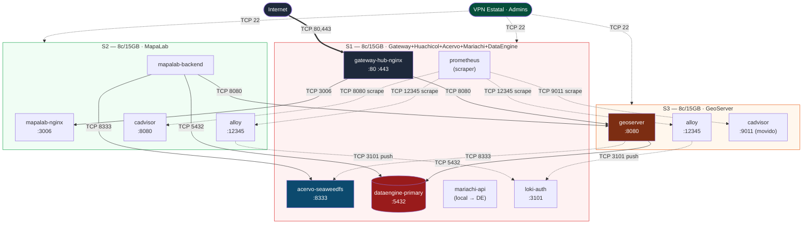

# Reorganizacion de servidores + checklist de puertos firewall

> **Estado:** propuesta de evaluacion + referencia exhaustiva para aperturas FortiGate.
> **Critico:** cada apertura firewall tarda ~2 semanas en aprobarse. Validar TODOS
> los puertos antes de enviar la solicitud. Un puerto omitido = 2 semanas mas de
> espera.

---

## 1. Por que reorganizar (recap del bin-packing real)

Inventario de produccion (de `docs/recursos-servidores.md`):

| Servidor | CPU | RAM total | RAM usada | RAM libre | Disco usado |
|---|---|---|---|---|---|
| S1 (Gateway+Huachicol+Acervo+Mariachi) | 8c | 15 GB | 1.6 GB | **13.4 GB** | 4% de 637 GB |
| S2 (MapaLab) | 8c | 15 GB | 587 MB | **14.4 GB** | 24% de 96 GB |
| S3 (GeoServer) | 8c | 15 GB | 1.4 GB | **13.6 GB** | 12% de 490 GB |
| S4 (DataEngine) | 4c | 7.7 GB | 676 MB | **7 GB** | 14% de 490 GB |
| **Total** | **28** | **52.7 GB** | **4.3 GB (8.2%)** | **~48 GB libres** | |

**Estamos pagando por 4 VMs cuando todo cabe en 2 con margen 3x.** La sub-utilizacion
no es bloqueante hoy pero abre dos oportunidades:

1. **Apagar S4** (consolidar postgres en S1). Ahorro ~$130-180 USD/mes y simplifica
   firewall en ~10 reglas inter-VM.
2. **Rebalancear** para mejor uso (opcion mas agresiva, mas complicada).

---

## 2. Opciones de reorganizacion

### 2.1. Opcion A — Apagar S4 (recomendada)

**Cambio unico:** mover `dataengine-primary` (PostgreSQL+PostGIS) de S4 a S1.

| Servidor | Servicios despues | RAM proyectada | Disco proyectado |
|---|---|---|---|
| S1 | Gateway + Huachicol + Acervo + Mariachi + **DataEngine** | ~4.2 GB / 15 GB (28%) | ~95 GB / 637 GB (15%) |
| S2 | MapaLab (sin cambios) | 587 MB / 15 GB (4%) | 96 GB (24%) |
| S3 | GeoServer (sin cambios) | 1.4 GB / 15 GB (9%) | 490 GB (12%) |
| ~~S4~~ | **APAGADO** | — | — |

**Beneficios:**
- Ahorro ~$130-180 USD/mes (~$1.5-2k/ano).
- 10+ reglas firewall menos (todos los puertos hacia/desde S4 desaparecen).
- Postgres en localhost para mariachi-api (latencia menor, una hop menos).

**Riesgos:**
- Postgres comparte VM con todo el resto. Si S1 muere, **todo el ecosistema cae**
  (hoy si S4 muere, mariachi y mapalab caen pero gateway+acervo+huachicol siguen).
- Crecimiento de disco S1 a medio plazo (Acervo + postgres + monitoreo todos en el
  mismo disco de 637 GB).

**Esfuerzo:** ~1 dia de trabajo + ventana de mantenimiento de ~30 min.

### 2.2. Opcion B — Rebalanceo agresivo (alternativa)

Re-distribuir por afinidad funcional para aislar dominios:

| Servidor | Hoy | Propuesta B |
|---|---|---|
| S1 | Gateway+Huachicol+Acervo+Mariachi | **Gateway + Acervo** (frontend pesado de I/O) |
| S2 | MapaLab | **Mariachi + Huachicol** (apps usuarios + monitoreo) |
| S3 | GeoServer | **GeoServer + MapaLab** (todo mapas juntos) |
| S4 | DataEngine | **DataEngine** (sin cambios, queda DB dedicada) |

**Beneficios:**
- Aislamiento por dominio: frontend, apps, mapas, datos.
- Postgres sigue en S4 (dedicado, mejor para tuning).

**Riesgos / Costos:**
- 3x mas trabajo de migracion que opcion A.
- Cambia hosts para ~7 servicios (cada uno requiere re-deploy + actualizar `.env`
  del gateway-hub con nuevos `*_HOST`).
- No ahorra dinero (siguen 4 VMs).
- Aperturas firewall cambian masivamente.

**Esfuerzo:** ~1 semana de trabajo + ventana de mantenimiento de ~2 horas.

**No la recomiendo** salvo que aparezca un dolor concreto que justifique aislamiento.

### 2.3. Opcion C — No mover nada (status quo)

Si las aperturas firewall son lentas y no se puede pedir multiple rondas, esta
opcion es valida. Igual hay que **documentar las aperturas actuales** porque hoy no
hay claridad sobre cuales estan y cuales no — proxima seccion.

---

## 3. Pasos de migracion (opcion A recomendada)

### Pre-cutover (1-2 dias antes)

1. **Backup `pg_dump --format=custom`** desde S4. Subir a Acervo bucket
   `dataengine` y a una location off-cluster.
2. **Reservar disco en S1**: validar que `BACKUP_DATA` y `POSTGRES_PRIMARY_DATA`
   apuntan a paths con espacio (>= 100 GB libre para postgres + crecimiento 12
   meses).
3. **Validar restore en VM aparte** (smoke test SELECT en tablas criticas).
4. **Coordinar ventana de mantenimiento** ~30 min.

### Cutover

1. Anunciar mantenimiento en gateway (pagina 503 o banner).
2. `make down` en mariachi-api, mapalab-backend, geoserver — todos los consumidores
   de la DB.
3. `pg_dump` final en S4.
4. `make down` en S4 (dataengine).
5. Clonar repo `dataengine` en S1 (`/IIEG/dataengine`).
6. Copiar `.env` adaptado (las vars `PG_BIND_ADDRESS`, `ALLOWED_HOSTS` cambian).
7. `make up` en S1.
8. Restaurar dump (`make restore FILE=...`).
9. Validar conexion: `psql -h localhost -p 5432 ...`.
10. Actualizar `.env` de mariachi (S1), mapalab (S2), geoserver (S3): cambiar
    `DATAENGINE_HOST` de IP de S4 a IP de S1 (o `localhost` para mariachi).
11. `make deploy` en cada uno.
12. Validar smoke tests E2E (login mariachi, render mapa mapalab, GetCapabilities
    geoserver).
13. Quitar banner de mantenimiento.

### Post-cutover

1. **NO apagar S4 inmediatamente** — dejar 7 dias con compose detenido pero VM
   prendida (rollback rapido si algo).
2. Si todo OK a la semana, eliminar S4 en GCP.
3. Actualizar `docs/recursos-servidores.md` y `docs/arquitectura.mmd`.
4. Actualizar `gateway-hub/Makefile` (`ecosystem-up` ya no necesita `cd
   $(DATAENGINE_DIR)` separado si dataengine queda en mismo host).

---

## 4. Inventario completo de puertos del ecosistema

Esta seccion es la **fuente de verdad** para solicitar aperturas. Verificada contra
los `docker-compose.yml` y `.env.example` de los 7 repos del orquestador.

### 4.1. Puertos publicos (Internet → S1)

| Puerto | Protocolo | Servicio | Notas |
|---|---|---|---|
| **80** | TCP | gateway-hub-nginx | HTTP, redirige 301 a 443 |
| **443** | TCP | gateway-hub-nginx | HTTPS publico (todo el trafico real) |

### 4.2. Puertos administrativos (VPN estatal → todas las VMs)

| Puerto | Protocolo | Servicio | Aplica a | Notas |
|---|---|---|---|---|
| **22** | TCP | SSH | S1, S2, S3, S4 | Admin server |
| **9090** | TCP | Prometheus UI | S1 | Acceso directo VPN (opcional, ya hay via gateway) |
| **9000** | TCP | Grafana UI | S1 | Acceso directo VPN (opcional, ya hay via gateway path `/huachicol`) |
| **5432** | TCP | PostgreSQL admin | S4 hoy / S1 si opcion A | Acceso de DBAs via VPN |
| **8080** | TCP | GeoServer admin | S3 | Acceso directo VPN (opcional, ya hay via gateway) |

> Los puertos 9090, 9000, 8080 NO son obligatorios si todos los admins usan el
> gateway (paths `/huachicol`, `/geoserver/web`). Pedir solo si hay flujos
> alternativos validados.

### 4.3. Puertos inter-VM HOY (Caso C, sin reorganizar)

**Para funcionamiento del producto (criticos):**

| # | Origen | Destino | Puerto | Servicio | Razon |
|---|---|---|---|---|---|
| 1 | S1 | S4 | 5432 | PostgreSQL | mariachi-api → iieg_portal DB |
| 2 | S2 | S4 | 5432 | PostgreSQL | mapalab-backend → schema mapalab |
| 3 | S3 | S4 | 5432 | PostgreSQL | geoserver datastore PostGIS |
| 4 | S1 | S2 | 3006 | HTTP | gateway → mapalab-nginx (proxy_pass /mapalab/) |
| 5 | S1 | S3 | 8080 | HTTP | gateway → geoserver Tomcat (proxy_pass /geoserver/) |
| 6 | S2 | S3 | 8080 | HTTP | mapalab-backend → GeoServer WMS/WFS interno |
| 7 | S2 | S1 | 8333 | HTTP S3 | mapalab-backend → SeaweedFS uploads/reads |
| 8 | S3 | S1 | 8333 | HTTP S3 | geoserver → SeaweedFS (si se usa para layers) — verificar |
| 9 | S4 | S1 | 8333 | HTTP S3 | dataengine-backup → SeaweedFS dump semanal |

**Para observabilidad (huachicol):**

| # | Origen | Destino | Puerto | Servicio | Razon |
|---|---|---|---|---|---|
| 10 | S1 | S2 | 12345 | HTTP | prometheus scrape → alloy/node-exporter en S2 |
| 11 | S1 | S3 | 12345 | HTTP | igual hacia S3 |
| 12 | S1 | S4 | 12345 | HTTP | igual hacia S4 |
| 13 | S1 | S2 | 8080 | HTTP | prometheus scrape → cadvisor en S2 |
| 14 | S1 | S3 | 8080 | HTTP | igual hacia S3 — **conflicto con regla 5** si geoserver tambien en S3; el cadvisor del agente remoto escucha en 8080 — ver nota |
| 15 | S1 | S4 | 8080 | HTTP | igual hacia S4 |
| 16 | S1 | S4 | 9187 | HTTP | prometheus scrape → postgres-exporter en S4 |
| 17 | S2 | S1 | 3101 | HTTP+basic auth | alloy push logs → loki-auth |
| 18 | S3 | S1 | 3101 | HTTP+basic auth | igual desde S3 |
| 19 | S4 | S1 | 3101 | HTTP+basic auth | igual desde S4 |

> **Nota sobre regla 14:** GeoServer escucha en 8080 (Tomcat) y el agente remoto
> de huachicol despliega cAdvisor tambien en 8080 — ambos en S3. **Conflicto de
> puerto host.** Solucion: en S3 mapear `huachicol-cadvisor` a puerto host
> distinto (ej. `CADVISOR_PORT=9011`) y actualizar `scripts/generate-targets.sh`
> del huachicol con la IP:9011 en vez de IP:8080.

**Total reglas inter-VM HOY: 19** (mas las publicas y admin).

### 4.4. Puertos inter-VM POST reorganizacion (Caso A — apagar S4)

Si dataengine se mueve a S1, **estas reglas cambian o se eliminan**:

| # original | Estado nuevo | Notas |
|---|---|---|
| 1 (S1→S4:5432) | **ELIMINADA** | mariachi-api → postgres ya es localhost |
| 2 (S2→S4:5432) | **CAMBIA a S2→S1:5432** | sigue siendo apertura inter-VM |
| 3 (S3→S4:5432) | **CAMBIA a S3→S1:5432** | sigue siendo apertura inter-VM |
| 9 (S4→S1:8333) | **ELIMINADA** | dataengine-backup ya es localhost |
| 12 (S1→S4:12345) | **ELIMINADA** | S4 apagado |
| 15 (S1→S4:8080) | **ELIMINADA** | S4 apagado |
| 16 (S1→S4:9187) | **ELIMINADA** | postgres-exporter pasa a localhost en S1 |
| 19 (S4→S1:3101) | **ELIMINADA** | S4 apagado |

**Reglas finales post-reorganizacion:**

| # | Origen | Destino | Puerto | Servicio |
|---|---|---|---|---|
| 2' | S2 | S1 | 5432 | PostgreSQL (mapalab→postgres) |
| 3' | S3 | S1 | 5432 | PostgreSQL (geoserver→postgres) |
| 4 | S1 | S2 | 3006 | HTTP (gateway→mapalab) |
| 5 | S1 | S3 | 8080 | HTTP (gateway→geoserver) |
| 6 | S2 | S3 | 8080 | HTTP (mapalab→geoserver) |
| 7 | S2 | S1 | 8333 | HTTP S3 (mapalab→acervo) |
| 8 | S3 | S1 | 8333 | HTTP S3 (geoserver→acervo, si aplica) |
| 10 | S1 | S2 | 12345 | HTTP (prom→alloy S2) |
| 11 | S1 | S3 | 12345 | HTTP (prom→alloy S3) |
| 13 | S1 | S2 | 8080 | HTTP (prom→cadvisor S2) |
| 14 | S1 | S3 | 9011 | HTTP (prom→cadvisor S3, **puerto cambiado** por conflicto Tomcat) |
| 17 | S2 | S1 | 3101 | Loki-auth push |
| 18 | S3 | S1 | 3101 | Loki-auth push |

**Total reglas inter-VM POST: 13** (vs 19 hoy). 6 reglas menos.

---

## 5. Diagrama de puertos — Caso A (post-reorganizacion)



---

## 6. Diagrama de puertos — Caso C (hoy, sin reorganizar)

```mermaid
graph TB
    INTERNET([Internet])
    VPN([VPN Estatal · Admins])

    subgraph S1["S1 — Gateway+Huachicol+Acervo+Mariachi"]
        S1_GW["gateway-hub-nginx<br/>:80 :443"]
        S1_ACE["acervo-seaweedfs<br/>:8333"]
        S1_MARI["mariachi-api"]
        S1_PROM["prometheus"]
        S1_LOKI["loki-auth<br/>:3101"]
    end

    subgraph S2["S2 — MapaLab"]
        S2_NGX["mapalab-nginx<br/>:3006"]
        S2_BE["mapalab-backend"]
        S2_ALLOY["alloy :12345"]
        S2_CAD["cadvisor :8080"]
    end

    subgraph S3["S3 — GeoServer"]
        S3_GS["geoserver<br/>:8080"]
        S3_ALLOY["alloy :12345"]
        S3_CAD["cadvisor :8080 ⚠️ CONFLICTO"]
    end

    subgraph S4["S4 — DataEngine"]
        S4_DE[("dataengine-primary<br/>:5432")]
        S4_PGB["pgbouncer :6432"]
        S4_PEXP["postgres-exporter :9187"]
        S4_BK["dataengine-backup"]
        S4_ALLOY["alloy :12345"]
        S4_CAD["cadvisor :8080"]
    end

    INTERNET ==>|TCP 80,443| S1_GW
    VPN -.->|TCP 22| S1
    VPN -.->|TCP 22| S2
    VPN -.->|TCP 22| S3
    VPN -.->|TCP 22| S4

    S1_GW -->|TCP 3006| S2_NGX
    S1_GW -->|TCP 8080| S3_GS

    S1_MARI -->|TCP 5432| S4_DE
    S2_BE -->|TCP 5432| S4_DE
    S3_GS -->|TCP 5432| S4_DE

    S2_BE -->|TCP 8333| S1_ACE
    S3_GS -.->|TCP 8333| S1_ACE
    S4_BK -->|TCP 8333| S1_ACE
    S2_BE -->|TCP 8080| S3_GS

    S1_PROM -.->|TCP 12345 scrape| S2_ALLOY
    S1_PROM -.->|TCP 12345 scrape| S3_ALLOY
    S1_PROM -.->|TCP 12345 scrape| S4_ALLOY
    S1_PROM -.->|TCP 8080 scrape| S2_CAD
    S1_PROM -.->|TCP 8080 scrape| S3_CAD
    S1_PROM -.->|TCP 8080 scrape| S4_CAD
    S1_PROM -.->|TCP 9187 scrape| S4_PEXP

    S2_ALLOY -.->|TCP 3101 push| S1_LOKI
    S3_ALLOY -.->|TCP 3101 push| S1_LOKI
    S4_ALLOY -.->|TCP 3101 push| S1_LOKI

    style S1 fill:#fef2f2,stroke:#dc2626
    style S2 fill:#f0fdf4,stroke:#16a34a
    style S3 fill:#fff7ed,stroke:#ea580c
    style S4 fill:#fffbeb,stroke:#d97706
    style INTERNET fill:#1e293b,color:#fff
    style VPN fill:#064e3b,color:#fff
    style S1_GW fill:#1e293b,color:#fff
    style S4_DE fill:#991b1b,color:#fff
    style S1_ACE fill:#0c4a6e,color:#fff
    style S3_GS fill:#7c2d12,color:#fff
    style S3_CAD fill:#fef9c3,stroke:#eab308,color:#713f12
```



---

## 7. Checklist FortiGate — solicitud de aperturas

### 7.1. Si vas con Opcion A (post-reorganizacion)

**Aperturas a pedir (13 reglas inter-VM + 2 publicas + 4 SSH):**

```
# Publicas
ANY        → S1   TCP 80      HTTP (redirige)
ANY        → S1   TCP 443     HTTPS publico

# Admin (VPN estatal)
VPN_CIDR   → S1   TCP 22      SSH
VPN_CIDR   → S2   TCP 22      SSH
VPN_CIDR   → S3   TCP 22      SSH

# Inter-VM: aplicacion
S2         → S1   TCP 5432    PostgreSQL (mapalab → dataengine)
S3         → S1   TCP 5432    PostgreSQL (geoserver → dataengine)
S1         → S2   TCP 3006    HTTP (gateway → mapalab-nginx)
S1         → S3   TCP 8080    HTTP (gateway → geoserver Tomcat)
S2         → S3   TCP 8080    HTTP (mapalab → geoserver WMS/WFS)
S2         → S1   TCP 8333    HTTP S3 (mapalab → acervo)
S3         → S1   TCP 8333    HTTP S3 (geoserver → acervo, opcional)

# Inter-VM: observabilidad
S1         → S2   TCP 12345   HTTP (prometheus → alloy)
S1         → S3   TCP 12345   HTTP (prometheus → alloy)
S1         → S2   TCP 8080    HTTP (prometheus → cadvisor)
S1         → S3   TCP 9011    HTTP (prometheus → cadvisor — puerto movido por conflicto Tomcat)
S2         → S1   TCP 3101    HTTP+auth (alloy → loki)
S3         → S1   TCP 3101    HTTP+auth (alloy → loki)
```

**Total: 18 aperturas (2 publicas + 3 SSH + 13 inter-VM).**

### 7.2. Si vas con Opcion C (sin reorganizar, S4 sigue prendido)

**Aperturas a pedir (19 reglas inter-VM + 2 publicas + 4 SSH):**

```
# Publicas
ANY        → S1   TCP 80      HTTP (redirige)
ANY        → S1   TCP 443     HTTPS publico

# Admin (VPN estatal)
VPN_CIDR   → S1   TCP 22      SSH
VPN_CIDR   → S2   TCP 22      SSH
VPN_CIDR   → S3   TCP 22      SSH
VPN_CIDR   → S4   TCP 22      SSH

# Inter-VM: aplicacion
S1         → S4   TCP 5432    PostgreSQL (mariachi → dataengine)
S2         → S4   TCP 5432    PostgreSQL (mapalab → dataengine)
S3         → S4   TCP 5432    PostgreSQL (geoserver → dataengine)
S1         → S2   TCP 3006    HTTP (gateway → mapalab-nginx)
S1         → S3   TCP 8080    HTTP (gateway → geoserver Tomcat)
S2         → S3   TCP 8080    HTTP (mapalab → geoserver WMS/WFS)
S2         → S1   TCP 8333    HTTP S3 (mapalab → acervo)
S3         → S1   TCP 8333    HTTP S3 (geoserver → acervo, opcional)
S4         → S1   TCP 8333    HTTP S3 (dataengine-backup → acervo)

# Inter-VM: observabilidad
S1         → S2   TCP 12345   HTTP (prometheus → alloy S2)
S1         → S3   TCP 12345   HTTP (prometheus → alloy S3)
S1         → S4   TCP 12345   HTTP (prometheus → alloy S4)
S1         → S2   TCP 8080    HTTP (prometheus → cadvisor S2)
S1         → S3   TCP 9011    HTTP (prometheus → cadvisor S3 — puerto movido)
S1         → S4   TCP 8080    HTTP (prometheus → cadvisor S4)
S1         → S4   TCP 9187    HTTP (prometheus → postgres-exporter S4)
S2         → S1   TCP 3101    HTTP+auth (alloy S2 → loki)
S3         → S1   TCP 3101    HTTP+auth (alloy S3 → loki)
S4         → S1   TCP 3101    HTTP+auth (alloy S4 → loki)
```

**Total: 25 aperturas (2 publicas + 4 SSH + 19 inter-VM).**

### 7.3. Aperturas OPCIONALES (acceso directo VPN, no recomendadas)

Solo pedir si hay flujos que NO pasan por el gateway:

```
VPN_CIDR   → S1   TCP 9090    Prometheus UI directo
VPN_CIDR   → S1   TCP 9000    Grafana UI directo
VPN_CIDR   → S1   TCP 9002    AlertManager
VPN_CIDR   → S1   TCP 9003    Loki UI directo
VPN_CIDR   → S3   TCP 8080    GeoServer admin directo
VPN_CIDR   → S{N} TCP 5432    PostgreSQL directo para DBAs
```

**Recomendacion:** NO pedir estas. Todo va por gateway (paths `/huachicol`,
`/geoserver/web`, etc.) que ya esta abierto.

---

## 8. Notas criticas para la solicitud

### 8.1. Conflicto puerto 8080 en S3 (HAY QUE RESOLVER ANTES)

- **GeoServer (Tomcat)** escucha en host:8080 (mapeo `"8080:8080"` en
  `geoserver/docker-compose.yml`).
- **cAdvisor del agente huachicol** tambien quiere host:8080 (default
  `CADVISOR_PORT:-8080` en `huachicol/agent/docker-compose.yml`).

Si ambos corren en S3, **uno de los dos falla al arrancar** (port already in use).

**Solucion**: en el `.env` del agente huachicol en S3, setear `CADVISOR_PORT=9011`
(mismo valor que usa el cadvisor del stack principal). Luego en
`scripts/generate-targets.sh` del huachicol, agregar el `GEOSERVER_SERVER_IP:9011`
en vez de `:8080` para el target de cadvisor del servidor S3.

**Verificar antes de pedir aperturas** que esto este resuelto en config, o pedir
8080 para S3 sabiendo que cadvisor en S3 quedara sin scraper. Mejor pedir 9011.

### 8.2. Acervo SeaweedFS — puerto 8333 vs 9333

- **8333 = API S3** (clientes leen/escriben). Este es el que necesita apertura
  inter-VM.
- **9333 = master cluster** (interno SeaweedFS, no debe estar expuesto).
- **9091 = metrics interno** (no expuesto al host por default).

Pedir SOLO 8333. NO pedir 9333 ni 9091 a otros servidores.

### 8.3. PostgreSQL — 5432 vs 6432

- **5432 = postgres-primary directo** (lo que usa mariachi/mapalab/geoserver hoy).
- **6432 = pgbouncer pooler** (no se esta usando hoy desde clientes; pero el
  compose lo expone).

Pedir 5432. NO pedir 6432 a menos que migres clientes a usar pgbouncer (decision
separada).

### 8.4. Loki — 9003 (UI) vs 3101 (push auth)

- **3101 = endpoint autenticado para que agentes remotos hagan push** de logs.
  Esta es la apertura critica.
- **9003 = Loki UI directo** (opcional, ya hay acceso via gateway).

Pedir SOLO 3101 entre VMs. 9003 es opcional VPN.

### 8.5. Prometheus remote_write — 9091

- nginx-auth de huachicol expone **9091** como endpoint autenticado para
  remote_write desde agentes. **Hoy no se esta usando** (todos los scrapes son
  pull). Si en el futuro algun agente hace remote_write (ej. Federation), pedir
  esta apertura.

NO pedir 9091 a menos que actives Federation.

### 8.6. SSH desde Internet

NO pedir SSH desde Internet. Solo desde VPN estatal. Bastion host o IAP de GCP
recomendado si necesitan acceso desde fuera de oficina.

### 8.7. Healthchecks internos vs externos

Todos los healthchecks de docker-compose corren **dentro del container o entre
containers de la misma red Docker**. NO requieren aperturas firewall.

---

## 9. Validacion post-apertura

Despues de cada apertura concedida, validar con:

```bash
# Desde el servidor origen
nc -zv <ip_destino> <puerto>            # debe decir "Connection succeeded"
curl -v http://<ip_destino>:<puerto>/   # si es HTTP
```

Si falla:
1. Confirmar que el servicio destino esta corriendo (`docker ps`).
2. Confirmar que el container expone el puerto al host (`docker port <container>`).
3. Confirmar que el host escucha (`ss -tlnp | grep <puerto>`).
4. Si todo lo anterior OK, escalar la solicitud al firewall.

---

## 10. Resumen ejecutivo

**Decision principal:** Opcion A (apagar S4) ahorra $1.5-2k USD/ano, simplifica el
firewall en 6 reglas y consolida operacion. Riesgo: SPOF en S1.

**Si firewall lento + no se puede mover nada:** Opcion C documentada en seccion
7.2 — 25 aperturas exhaustivas para que funcione TODO (producto + observabilidad).

**Lo critico (no omitir):**
- Conflicto puerto 8080 en S3 entre GeoServer y cAdvisor → resolver en config
  antes de pedir aperturas.
- 3101 (loki push auth) en todas las VMs hacia S1, no confundir con 9003 (UI).
- 8333 (Acervo S3) hacia S1, no 9333 (master interno).
- 5432 (postgres directo), no 6432 (pgbouncer no se usa).
- NO pedir SSH publico, solo VPN.

**Total aperturas:**
- Opcion A: **18** reglas.
- Opcion C: **25** reglas.

A 2 semanas por apertura: opcion A puede salir en ~9 meses (en paralelo si
permiten), opcion C en ~12 meses. **Pedir en lotes de paralelizables, no en
serie.**
